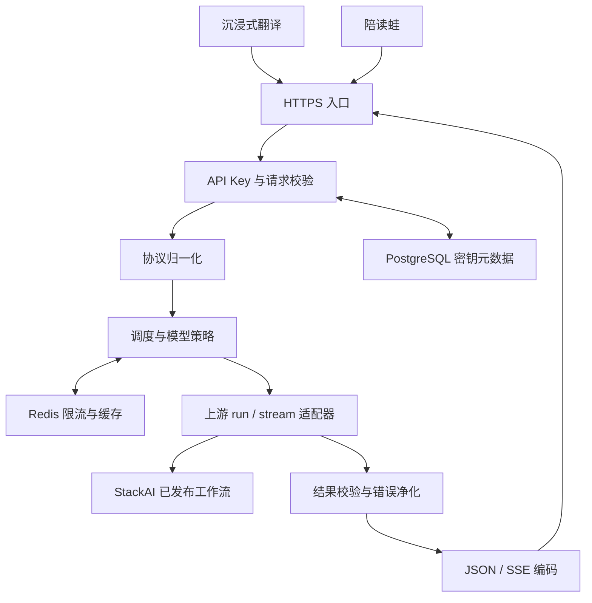

# StackAI 翻译代理网关实施计划书

> **For agentic workers:** 实施时使用 `superpowers:executing-plans` 按任务执行；如用户选择委派，可使用 `superpowers:subagent-driven-development`。本次交付为研究与实施计划，未执行服务开发、部署或真实工作流推理。

**Goal:** 将指定 StackAI 翻译工作流封装为独立管理 API Key 的 HTTPS 网关，支持沉浸式翻译、陪读蛙，以及流式和非流式翻译。

**Architecture:** 一个无状态异步服务提供两种客户端协议，共用鉴权、请求归一化、模型路由、调度、缓存与上游适配器。PostgreSQL 保存密钥元数据，Redis 协调限流和缓存，上游凭据只在服务端持有。

**Tech Stack:** 建议 Python + FastAPI/ASGI + HTTPX + PostgreSQL + Redis + 容器部署；版本在实施任务 1 中选择届时受支持的发行版并锁定。本文是架构选型建议，不声称已完成这些组件的性能实测。

**Spec:** 本文件第一至九节为研究与设计规格，第十节为实施任务，第十一节为验收门槛。

**修订版本:** v1.3（以附件 `stream_query(1).py` 作为上游协议证据基准，另建 `stackai_stream_contract/stream_query_hardened.py` 补齐当前可离线确定的严格状态机）。原附件的 10 项无网络回放仍为 4 项通过、6 项失败；加强版 25 项测试和 8 个脱敏 fixture 已通过。它是可复用的本地契约实现，不代表网关、真实上游或端到端验收通过；未修改附件或发起真实上游请求。

**研究日期:** 2026-09-15。陪读蛙源码核对基线：提交 `514188603026bf4783864072f53d288bb8a0f331`，其中 `package.json` 标注版本 `1.47.2`。这是源码基线，不代表所有浏览器商店的已安装版本。[版本文件](https://github.com/mengxi-ream/read-frog/blob/514188603026bf4783864072f53d288bb8a0f331/package.json)

## 全局约束

- 已知工作流接口：`in-0` 为待翻译文本，`in-1` 为 `model_id`，`in-2` 为目标语言，`out-0` 为翻译结果。
- 网关自行签发、验证、撤销 API Key；浏览器扩展不持有 StackAI 凭据。
- 本次 run 导出示例使用 `https://api.stackai.com/inference/v0/run/{org_id}/{flow_id}`；成功流式用例的脚本默认使用 `https://api.stack-ai.com/inference/v0/stream/{org_id}/{flow_id}`。分开配置两个 base URL，不假设两个域名的行为完全相同。
- run 完整结果路径固定为 `outputs["out-0"]`；stream 同一路径是文本增量，逐帧追加。已观察到的完成标志为 `state="COMPLETED"`。
- 流式请求 JSON 显式包含 `"stream":true`；HTTP 客户端还必须开启响应流读取。这是两个不同层面的开关。
- 上游错误中包含 `stack-ai.com`、`stackai.com`、`support@stackai.com`、`support@stack-ai.com` 等品牌相关字段或链接时，统一替换为精确字符串 `Upstream`。
- 未经实测确认的上游响应结构不得作为已验证契约写入生产适配器；不把上游事件原样转发给客户端。
- 首版支持文本翻译、段落批量、占位符保留；不承诺通用聊天、工具调用、图片、任意结构化输出、解释和词卡等能力。
- 本文的容量、超时和配额数值是初始工程配置，必须在真实额度和客户端版本下校准。

## 一、结论与证据边界

推荐建立一个具备两种协议适配器的网关：

1. `/v1/chat/completions`：供陪读蛙的 OpenAI-compatible provider 使用，也供沉浸式翻译的 OpenAI 自定义地址使用。这是首版优先接入路径，便于两款扩展直接填写网关 API Key。
2. `/v1/translate`：实现沉浸式翻译原生 Custom API 的 `text_list → translations` 协议。接口本身纳入首版；扩展侧是否能通过当前 Custom API 配置发送鉴权头，作为独立联调门槛。

选用 OpenAI-compatible 的 HTTP 外壳，不意味着这个三输入工作流自动成为通用 Chat API。必须明确提取待翻译文本、目标语言和模型，并重建客户端所要求的响应。

| 事项 | 已核实内容 | 实施中必须验证的边界 |
| --- | --- | --- |
| StackAI run | 用户成功响应确认 `outputs["out-0"]` 为完整字符串；`state="COMPLETED"`、`error=null`、`pause=null` | 失败体、暂停、截断、发布版本及响应头 |
| StackAI stream | 脚本采用 POST、正文 stream=true、JSON Lines；debug 样本确认 out-0 增量、混合帧与 COMPLETED 结束帧 | 响应 Content-Type、原始行边界、失败/取消样本、版本控制；metadata.done 仅为附件提及的兼容项 |
| StackAI LLM 参数 | 用户截图和 Flash-Lite 节点参数：stream=true、max_tokens=65536、temperature=1、safe context=false、retry=false | 另一 LLM 分支的参数；输出截断和目标客户端时限 |
| 沉浸式翻译 | 官方原生 Custom API 契约、OpenAI 自定义地址、提示词变量 | 原生 Custom API 的鉴权字段、各浏览器版本流式表现；当前仓库不含源码 |
| 陪读蛙 | 官方 provider 配置；源码证实 Bearer 路径、文本生成、流式、批量分隔符 | 商店版本和源码基线可能不同；需要在目标版本完整验收 |

本次证据优先级为：用户提供的实际响应与节点运行数据 → 用户截图 → 附件可执行代码 → 附件注释中的历史测试说明 → 前轮官方文档研究。现已可以按实际成功契约实现 run 和真实流式适配器，不再以“完全未知流式格式”为由只规划缓冲 SSE。附件提到的 `docs/research/03-stream-protocol-actual.md` 未随本次材料提供，不把其中未见到的细节当作已经阅读的证据。公开 [API Reference](https://docs.stackai.com/interface-and-deployment/api-reference) 仍用于一般说明，不能替代本工作流样本。

本次材料已证明用户成功运行了翻译流程；网关还未开发和上线。下文标注“样本确认”指核对用户提供证据，不表示本次重新调用上游。

## 二、StackAI 工作流与节点研究

### 2.1 工作流的组成

StackAI 通过画布节点、连接关系和变量引用构建流程；节点接收输入、执行处理，再将结果交给下游。编辑后的流程需要发布，API 使用发布版本。官方目录可归纳为以下类别，表中是代表节点，不是完整清单。[Workflow Builder](https://docs.stackai.com/getting-started/start-here/get-started-with-workflow-builder)、[节点目录](https://docs.stackai.com/llms.txt)、[API 导出](https://docs.stackai.com/interface-and-deployment/end-user-interfaces/api)

| 类别 | 代表节点 | 在本项目中的用途 |
| --- | --- | --- |
| 输入与触发 | Input、Files、URL、Audio、Image、Trigger | 三个文本输入即足够；不开放上传和任意 URL 抓取 |
| AI 与知识 | AI Agent/LLM、Knowledge Bases、平台工具 | LLM 执行翻译；纯翻译首版不增加检索 |
| 流程逻辑 | If/Else、AI Routing、Loop Subflow、Code、Python | 如需按 `in-1` 分支选择模型，可采用经过验证的路由 |
| 外部系统与工具 | Apps、Custom API、StackAI Project、Delay、Shared Memory | 与本翻译流程无关的工具不加入执行链 |
| 输出 | Output、Template、Image、Audio、Action | 只读取文本结果 `out-0` |

用户第三张截图确认实际拓扑：`in-0`、`in-1`、`in-2` → If/Else「Route by Model ID」→ 两个 LLM 分支之一 → 共享输出「Translation Result / out-0」。不是把任意 model_id 动态传入同一个 LLM 节点。

| in-1 / 路由条件 | 工作流实际行为 | 网关策略 |
| --- | --- | --- |
| `gemini-3.7-flash` | 截图中的显式条件进入 Translate (Gemini Flash) | 记录为候选分支，取得该分支成功响应和参数后才对外启用 |
| `gemini-3.1-flash-lite` | 默认输入值，进入 ELSE 的 Translate (Gemini Flash-Lite)；节点输出确认模型 ID | 首版启用；`translate-default` 映射到该 ID |
| 其他字符串 | ELSE 可能使其落入 Flash-Lite | 网关在调用前返回 403 `model_not_allowed`，不让拼写错误静默改用默认模型 |

这里的模型字符串来自用户截图和运行数据，只用于该工作流的路由契约，不构成对供应商模型目录的独立查询结论。需在任务 1 对缺失、空字符串、未知 ID 补负例；未知 ID 的具体上游响应尚无样本，网关白名单不依赖其回退结果。

工作流总节点为 7，但一次分支运行只经过 6 个节点；本次结束帧为 `completed_nodes=6, total_nodes=7, state="COMPLETED"`。**不能等待 completed_nodes 等于 total_nodes 才完成**，否则 If/Else 未选分支会导致误超时。

### 2.2 五项 LLM 配置：以实际参数为基线

前轮 [Advanced Settings](https://docs.stackai.com/workflow-builder/core-nodes/ai-agent-node/advanced-settings) 的默认值只作背景。下面的实际值来自本次两张设置截图和 Flash-Lite 节点输入/输出，应优先于此前的建议值。

| 配置 | 当前实际值 | 网关实施决策 |
| --- | --- | --- |
| Stream Data | 开启；`params.stream=true` | 保持，配合 stream 路径和正文 stream=true；不替代客户端流读取开关 |
| Max Output Length | `65536`；`params.max_tokens=65536` | 作为当前流程配置记录；不是上下文总容量，也不是每次输出都会达到的长度 |
| Temperature | `1` | 首版客户端省略该参数或发送 1，与当前节点一致；删除旧计划“首版直接用 0”的假设 |
| Safe Context Token Window | 关闭；`safe_context_token_window=false` | 保持；网关负责预算与安全分段，避免依赖自动裁切 |
| Retry on Failure | 关闭（截图） | 保持，由网关统一掌握重试预算 |

截图同时显示 LLM Fallback Mode 关闭、On Error 为 Stop workflow；节点记录 `is_fallback_enabled=false`。无证据表明存在备用模型或失败后自动返回替代译文，不能把这种能力写成现有保证。

其他已确认参数：`NoMemory`、`response_format="text"`、`n=1`、`top_p=1`、`seed=42`、`use_reasoning=false`，guardrails/citations/charts/date/references/file access 关闭，tools/skills/MCP 无配置。seed 固定和 Temperature=1 不构成每次输出完全相同的保证。另一 Flash 分支是否相同仍需单独确认。

**输出上限与高并发：** 65536 是当前节点的生成上限，不代表实际用量或已验证最大上下文。首版通过短段、输入 token 预算、输出字节上限和总 deadline 控制资源。后续若为高并发另建较小输出上限的发布配置，先评估翻译完整性与延迟，单独版本化并清理缓存；不在 API body 里加 `max_tokens` 就假定能覆盖节点设置。Temperature 改为 0/其他值也只作为未来对照实验，不能未经配置变更就写入客户端示例。

**user_id：** 用户 run 示例和流式脚本均传 `"user_id":""`。当前节点为 NoMemory，因此网关首版按已成功契约保留空字符串；运行记录中内部生成的 user_id 不当作终端用户标识，也不回传客户端。后续若开启记忆或要求每请求独立 user_id，必须先验证其行为并实施租户/会话隔离。user_id 不是幂等键。[Memory 的一般说明](https://docs.stackai.com/workflow-builder/core-nodes/ai-agent-node/main-settings)

当前工作流系统提示词为专业翻译、保留含义/语气/格式、只输出译文；user prompt 引用目标语言和原文，未给目标语言时默认 English。网关依然要求显式目标语言，缺失时返回 400，不静默依赖 English 默认值。

目前原始提示词只提出通用的“preserving formatting”，尚没有逐项约束 HTML 属性标记、公式占位符和 `%%` 分段。这些仍是网关的格式验证与工作流提示词强化任务；不能因短句成功就视为复杂网页格式已经验收。原文仍作为数据独立传入 in-0，不能把客户端整段 system/messages 转成新的上游系统指令。

### 2.3 非流式接口：实际成功契约

本次工作流官方导出示例使用**无连字符**主机 `api.stackai.com`：

```http
POST https://api.stackai.com/inference/v0/run/{org_id}/{flow_id}
Authorization: Bearer <UPSTREAM_API_KEY>
Content-Type: application/json

{
  "in-0": "Hello, world!",
  "in-1": "gemini-3.1-flash-lite",
  "in-2": "Simplified Chinese",
  "user_id": ""
}
```

用户提供的成功响应如下（run_id 是本次样本的运行标识）：

```json
{
  "outputs": {"out-0": "你好，世界！"},
  "citations": null,
  "run_id": "ccd05307-fe35-4474-9b5f-c84853297b60",
  "metadata": null,
  "progress_data": null,
  "state": "COMPLETED",
  "pause": null,
  "error": null
}
```

精确提取路径固定为 `response["outputs"]["out-0"]`，JSON Pointer 为 `/outputs/out-0`。这是完整译文，不能读取根级 `out-0`、根级 `text` 或根级 `completion`。

run 适配器成功条件：HTTP 成功；JSON 为对象；`error` 明确为 null；`pause` 明确为 null；`state=="COMPLETED"`；outputs 为对象且 out-0 为字符串；对于非空原文，译文不能是空字符串或全空白。缺失关键字段、错误/暂停、未知状态或非字符串均拒绝，不做递归猜字段。可兼容未知额外元数据，但不将它们透传。

即使 HTTP 200 或包含译文，只要 error 非 null，整次调用仍判失败。错误字段结构、暂停及模型拒绝/截断状态尚无真实负例，按受控 `upstream_protocol_error`/`upstream_error` 分类并补采样。

**节点内部输出与外部 API 的层级区别：**

| 层级 | 已观察到的字段 | 网关读取规则 |
| --- | --- | --- |
| LLM 节点输出 | `completion`，provider.model=`gemini-3.1-flash-lite` | 用于配置/质量核验，不从公共 run 根级读取 |
| out-0 节点输入 | `rendered_text` | 当前样本等于 LLM 译文 |
| out-0 节点输出 | `text`、`raw_text`、`delta`，均为“你好，世界！” | 节点调试视图，不是公共响应 schema |
| 公共 run 响应 | `outputs["out-0"]` | 一次完整结果 |
| 公共 stream 帧 | `outputs["out-0"]` | 每帧增量，必须追加 |

本样本三个节点层级的译文一致，支持直接消费公共 out-0。未来若修改 Output 模板、增加包装或后处理，必须更新输出契约并回归 run/stream；不要改为转发中间 LLM 文本。

[Run Flow 文档](https://docs.stackai.com/interface-and-deployment/api-reference/run-flow) 仍提供 `version`（默认 -1）、`verbose`（默认 true）和 422 schema 的一般说明；本次成功示例没有这些查询参数。保持成功请求形状用于初始联调，再验证固定发布版本；不能把文档参数视为已经在该工作流测过。

422 文档形态示例（非本次真实负例）：

```json
{"detail":[{"loc":["body","in-0"],"msg":"Invalid input","type":"value_error"}]}
```

### 2.4 流式接口：JSON Lines 增量契约

当前参考附件 `stream_query(1).py` 使用**带连字符**的默认主机 `api.stack-ai.com`，HTTP POST、Bearer、JSON 请求体；其 main() 明确增加 `stream:true`：

```http
POST https://api.stack-ai.com/inference/v0/stream/{org_id}/{flow_id}
Authorization: Bearer <UPSTREAM_API_KEY>
Content-Type: application/json
Accept: text/event-stream

{
  "in-0": "Hello, world!",
  "in-1": "gemini-3.1-flash-lite",
  "in-2": "Simplified Chinese",
  "user_id": "",
  "stream": true
}
```

必须区分三项：LLM 节点的 Stream Data 开启；请求 JSON 的 `"stream":true`；HTTP 库的流式读取（附件中 `requests.post(..., stream=True)`）。最后一项不会自动修改 JSON 请求体。附件注释报告省略正文 stream:true 会输出为空；本计划始终显式传 true，但“省略时恒为空”作为待补负例的历史说明，不泛化为所有流程的官方保证。

**传输封装：** 附件以 `iter_lines` 按换行读取完整 JSON 对象，注释标为 JSON Lines/非标准 SSE；用户 debug 展示的是解码后的帧。当前配置采用 `stackai-jsonl-delta-v1`，默认按 JSON Lines 解码；兼容一个 `data:` 前缀作为有界可选兼容项，不因此切换到完整 SSE 协议，也不照搬脚本循环剥离四层前缀的宽松规则。真实响应 Content-Type 和偶发前缀的原始字节尚未给出，任务 1 补录即可，不再把 out-0 路径或增量语义列为完全未知。

请求 Accept=text/event-stream 不能证明响应是 SSE。应分别配置 `run_base_url=https://api.stackai.com` 和 `stream_base_url=https://api.stack-ai.com`，设置服务器端主机白名单，不跨域跟随重定向或自动轮换主机。两个主机仍共用同一组织的上游额度；它们不是两个独立容量池。附件对其他主机 TLS 行为的历史注释不作为跨环境结论。

### 2.5 用户 debug 帧与解析状态机

本次 debug 统计为 13 个进度帧、7 个内容帧、1 个完成帧，累计输出 258 个字符。以下仅抽取每类帧的关键字段，保留混合字段结构：

```json
{"outputs":{},"run_id":"sample-run","metadata":{},"progress_data":{"current_node":"Text to Translate","total_nodes":7,"started_nodes":1,"completed_nodes":0},"state":null,"pause":null,"error":null}
```

```json
{"outputs":{"out-0":"OpenAI"},"run_id":"sample-run","metadata":{},"progress_data":{"current_node":"Translation Result","total_nodes":7,"started_nodes":6,"completed_nodes":5},"state":null,"pause":null,"error":null}
```

```json
{"outputs":{"out-0":" 的文本生成模型（通常称为生成式预训练 Transformer，简称“GPT”"},"run_id":"sample-run","metadata":{},"progress_data":{"current_node":"Translation Result","total_nodes":7,"started_nodes":6,"completed_nodes":5},"state":null,"pause":null,"error":null}
```

```json
{"outputs":{},"run_id":"sample-run","metadata":{},"progress_data":{"current_node":"Translation Result","total_nodes":7,"started_nodes":6,"completed_nodes":6},"state":"COMPLETED","pause":null,"error":null}
```

同一帧同时拥有 progress_data 和 out-0，最后一帧同时拥有 progress_data 和 COMPLETED。字段不是互斥事件类型。out-0 第二个片段从空格开始，并非第一个片段的累计快照；须原样拼接，不能 trim 内容、覆盖累计文本或计算公共前缀差分。

每帧处理优先级如下：

1. 有界解析 JSON；验证字段类型与 run_id，以及必需的 outputs/state/error/pause 字段。第一次记录 run_id，后续变化视为协议错误。没有事件序号，因此不按相同文本或相同 run_id 去重：重复词句也可能是合法增量。
2. 先检查 error 非 null、pause 非 null。当前版本已观察到的状态只有 null 与 COMPLETED，其他状态默认受控失败；未来新增中间状态须先补 fixture 再扩展白名单。失败优先于同帧内容或完成，净化后终止；不把错误帧中的内容先输出。
3. 读取进度更新指标，但不 `continue`，不依赖 current_node 名称判断内容有效性，也不等待 7/7 节点。
4. 若存在字符串 outputs.out-0，作为增量处理；只在缺失或空增量时不输出。非字符串拒绝。允许同帧随后处理 COMPLETED。
5. `state=="COMPLETED"` 且无 error/pause：先完成本帧内容处理，再做累积结果/占位符校验，正常结束。最后一帧 outputs={} 不会清空先前译文。
6. 未出现成功完成状态就遇到 EOF、无效 JSON、超时或断连，按失败结束；部分译文不缓存、不发送正常 stop/[DONE]。

`metadata.done` 在用户贴出的真实帧中没有出现，只有附件的函数和历史注释提及。首版仅以 `state=="COMPLETED"` 为成功终止依据；待取得实际 done 帧后再添加版本化规则，只接受明确布尔值，并让 error/pause/失败状态始终优先。不能照搬 `str(done).lower()=="true"` 将字符串宽松当成功。

内部状态机示意（这是拟实施规则，不是已部署代码）：

```text
validate_frame(frame)
if error is not null or pause is not null or invalid_state(frame):
    fail_with_sanitized_error()
observe_progress(frame.progress_data)
if outputs contains out-0:
    append_and_emit_delta_without_trimming(outputs[out-0])
if state == COMPLETED:
    validate_complete_translation()
    finish_successfully()
on EOF before successful completion:
    fail_without_success_marker_or_cache()
```

### 2.6 新附件审阅与基准状态

最新协议参考为 `stream_query(1).py`，旧文件 `stream_query.py` 只保留为历史对比，不再把旧版的进度分支提前 continue 问题记为新版未修复问题。

本次审阅文件 SHA-256：`225dbefb77fa50cd781253aff30fade144062f4ae6e11c5d91a4f71e8f9b217f`。后续发现同名文件有改动时，应按内容哈希区分版本。

新版先检查 truthy error，再读取内容；只有没有非空文本时才进入纯进度显示分支；随后统一检查 is_done。因而修复了此前 progress_data 与 out-0 共存导致的内容丢失、progress_data 与 error 共存导致的错误丢失，以及内容分支 continue 导致同帧完成标志被跳过的问题。新增的 --debug 和统计输出也与用户提供日志的输出形式相符；这不能证明它就是那次远程运行的完全相同字节版本，但不再存在旧版缺少这些代码路径的差异。

**离线验证方法：** 对源文件做 AST 语法检查；导入后替代 requests 模块，用本地模拟 Response 向原 stream_query 函数送入完整行。没有改写待测解析函数，没有真实请求，也未测 requests 的网络解码、实际响应头或 chunk 分割行为。模拟边界帧用于验证网关预期，不表示上游已经真实产生过这些异常。

| 回放场景 | 新版结果 | 评审结论 |
| --- | --- | --- |
| progress+content，后接 progress+COMPLETED | 累计“你好”2 个字符，返回 0 | 原混合帧丢内容问题已修复 |
| content+COMPLETED 在同一帧 | 累计2个字符，返回0 | 同帧完成标志处理已修复 |
| progress+error | 返回 1 | 非空错误优先检查通过 |
| error+content+COMPLETED | 返回 1，不输出该帧译文 | 非空错误优先于成功通过 |
| 内容后 EOF，没有完成帧 | 返回 0，仍打印完成 | 未修复；必须判未完成失败 |
| 非空请求仅收到空 outputs 的 COMPLETED | 返回 0，仅打印诊断 | 未修复；必须判空译文失败 |
| 内容之间有损坏 JSON，之后 COMPLETED | 跳过损坏行，拼接残余内容后返回 0 | 未修复；可能把缺片段译文当成功 |
| pause 非空，同时 COMPLETED | 返回 0 | 尚无暂停处理；生产应拒绝 |
| state=FAILED，同时 metadata.done=true | 返回 0 | is_done 不校验失败状态；生产需失败优先 |
| 内容帧之间 run_id 改变 | 拼接后返回 0 | 缺少运行标识一致性校验 |

以上 10 项：4 项通过，6 项未满足本计划的生产校验要求。前4项直接覆盖本次修复的核心分支；后6项覆盖异常终止及边界输入。不能将结果概括成“新版完全正确”。

**采用范围：** 以新版的端点、请求 body、JSON Lines 逐行读取、out-0 增量拼接和混合帧修复为实施参考。网关最终仍按 2.5 节的严格状态机执行。异常处理待办必须包含：

- 引入独立的 saw_completed 成功标志；EOF、空输出和状态失败不返回成功，不能只打印诊断。
- 无效 JSON/非对象帧/非法字段类型进入协议错误；仅允许已定义的空行和心跳。
- 先验证 error/pause/状态。新版用 frame.get("error") 的真值检查，仍不等同于契约要求的“error 明确为 null”；容器类型、空对象或缺字段不能直接放行。
- 校验 run_id 一致；内容仍按增量追加，不按重复文本去重。
- metadata.done 的字符串兼容仍只存在于脚本，未获真实帧证明。当前生产契约继续以 state=COMPLETED 为准，后续有样本再扩展。
- 对 HTTP 和流中错误应用统一 Upstream 净化，原始 debug/异常输出不直接用于公共网关。

新版 stats.progress 只在无非空 out-0 时计数；同一终止帧可同时计入 progress 和 done。这些计数不是互斥帧总数，不应直接相加推算物理帧数量；网关分别统计总帧、含进度帧、含内容帧和终止帧。

本次没有修改新旧附件。`stream_query(1).py` 继续作为正常流证据基准，尚不作为未经修正即可部署的网关实现。已确认的 run 路径、流式增量、COMPLETED、If/Else 和 Flash-Lite 配置不变；剩余补证仍是响应头/原始行边界、另一模型分支、真实错误/暂停/截断/取消、版本锁定及两款扩展联调。

### 2.7 本地严格契约补齐（2026-09-16）

在不覆盖附件的前提下，新增 `stackai_stream_contract/`：其中加强版诊断脚本保留原请求 URL、Bearer、`stream:true`、三输入映射和实时增量输出，并把解析收敛为可单测的严格状态机。测试先复现原版 4/10 的基线，再覆盖以下当前材料足以确定的行为：

- EOF 未完成、非空输入的空结果、损坏/非对象 JSON、字段缺失或类型非法均失败；
- error/pause 只要非 null 就优先失败；FAILED 等未知状态不能被 metadata.done 覆盖；
- 首帧固定非空字符串 run_id，后续变化失败；成功仅认 state=COMPLETED；
- 混合进度/内容、同帧内容/完成、6/7 节点完成、空行、心跳及 data: 前缀兼容继续通过；
- HTTP、流内、异常及 debug 错误路径统一净化品牌字符串，正常译文不净化；
- 8 个 JSONL fixture 只保留帧 JSON，使用固定 UUID 和合成文本，不含凭据、组织、流程或真实用户内容。

本地最终结果为 25/25 通过。fixture 是合成负例，用来固化网关应有行为，不表示真实上游已产生这些异常。加强版仍是同步诊断/契约工具；网关实现时应复用状态规则，而不是直接把该脚本当作 ASGI 生产适配器。

## 三、两款扩展的官方接入研究

### 3.1 沉浸式翻译：原生 Custom API

官方入口是“选项 → 开发者设置 → 开启 Beta 测试特性”，再在常规设置选择 Custom API。官网规定 POST JSON；请求含 `source_lang`、`target_lang`、`text_list`；响应含 `translations` 数组，每项带 `detected_source_lang` 和 `text`。需保持占位符完整。[Custom Interface Translation](https://immersivetranslate.com/en/docs/services/custom/)

```json
{
  "source_lang": "auto",
  "target_lang": "zh-CN",
  "text_list": ["Hello", "Good morning"]
}
```

对应网关返回：

```json
{
  "translations": [
    {"detected_source_lang":"en","text":"你好"},
    {"detected_source_lang":"en","text":"早上好"}
  ]
}
```

数组长度、顺序必须与输入一一对应。源语言为 auto 时，网关使用本地语言检测并映射成扩展接受的代码；检测不可靠时，仅在任务 1 证实客户端接受 `detected_source_lang:"auto"` 后使用该值，否则返回 422 `source_language_undetermined`。不把目标语言冒充检测结果。本例 `en` 仅用于两个英语样例。客户端明确给定源语言时返回该源语言代码，不声称做过额外检测。

**鉴权证据边界：** Custom API 页面没有定义必选 `Authorization`、`api_key` 或签名算法；不能据此认定“API Key 输入框必定会发送 Bearer”。官方高级配置存在 `headerConfigs`，但示例针对其他服务，尚需确认它对当前 `custom` provider 生效。候选配置如下：[高级配置](https://immersivetranslate.com/en/docs/advanced/)

```json
{
  "translationServices": {
    "custom": {
      "apiUrl": "https://translate.example.com/v1/translate",
      "headerConfigs": {
        "Authorization": "Bearer <GATEWAY_API_KEY>"
      }
    }
  }
}
```

这个 JSON 是**待验证的适配配置**，`custom` 的真实 provider 标识须从安装版本最终配置确认。若鉴权头未发送，使用下一节的 OpenAI 自定义地址路径；不得因兼容问题取消鉴权。首版不使用 URL query 或 path 携带长期密钥。

### 3.2 沉浸式翻译：OpenAI 自定义地址

官方支持在 OpenAI 服务配置中填写 API Key，并在更多设置指定自定义 API 地址。网关侧采用 `Authorization: Bearer <GATEWAY_API_KEY>`；通过联调确认扩展实际请求头，而不是套用 Azure 的 `api-key` 规则。[OpenAI 配置](https://immersivetranslate.com/docs/services/openai/)

| 配置项 | 建议值 |
| --- | --- |
| 服务 | OpenAI，使用用户自己的 API 配置 |
| API Key | 网关单独签发给此扩展的 Key |
| 自定义 API 地址 | `https://translate.example.com/v1/chat/completions`，填写完整端点 |
| 自定义模型 | `translate-default`，映射已确认的 `gemini-3.1-flash-lite` |
| Temperature | 省略或设置为 1，与当前流程一致 |
| 单次段落数 | 首次联调设为 1；验证批量后逐级增加 |
| 客户端速率 | 首次联调设为 1 请求/秒，后续与 Key 配额同步 |
| 请求超时 | 60,000ms；网关默认更早终止 |

官方提示词变量为 `{{text}}`、`{{from}}`、`{{to}}`；支持单段、多段与字幕提示词，多段默认使用 `%%` 分隔，也可以使用 YAML。不同模式不能用一个不识别包装的“最后消息转发”逻辑覆盖。[AI Prompt Configuration Guide](https://immersivetranslate.com/en/docs/prompts/)

首版普通文本用户提示词统一为以下网关约定（不是扩展的内置协议）：

```text
TGW/1
target={{to}}

{{text}}
```

系统提示词设置为 `TGW/1 translation profile`。多段 `multiplePrompt` 也使用同样前缀和 `{{text}}`，内容中的独立 `%%` 行交由已验证的批量配置处理。首版不启用 YAML 字幕、AI 术语或上下文增强模式；这些功能需要额外的结构化输入契约。

配置 `systemPrompt`、`prompt`、`multiplePrompt` 时，从当前版本的最终配置核对字段；官网多段系统提示词名称也存在 `systemMultiplePrompt` 与示例 `multipleSystemPrompt` 的差异，不能盲目复制。网关只依赖用户消息中的 TGW 前缀提取路由参数，不能依赖猜测系统字段名。[AI Prompt Configuration Guide](https://immersivetranslate.com/en/docs/prompts/)

### 3.3 陪读蛙：OpenAI-compatible provider

官方路径为 Options → API Providers → 添加 OpenAI-compatible provider → 填写 Base URL、API Key、模型标识 → 启用并 Test Connection。可以添加自定义 headers；官方明确提醒简单翻译可用，不代表所有结构化 AI 功能可用。[OpenAI-Compatible Custom Providers](https://www.readfrog.app/en/docs/providers/openai-compatible-providers)

源码构建 `createOpenAICompatible({baseURL, apiKey, headers, supportsStructuredOutputs:true})`；网页翻译调用 `generateText`，划词流式能力使用 `streamText`。SDK 给兼容 provider 增加 Bearer 鉴权并将 `/chat/completions` 拼接到 Base URL。[provider 构建](https://github.com/mengxi-ream/read-frog/blob/514188603026bf4783864072f53d288bb8a0f331/src/utils/providers/model.ts)、[网页翻译](https://github.com/mengxi-ream/read-frog/blob/514188603026bf4783864072f53d288bb8a0f331/src/utils/host/translate/api/ai.ts)、[SDK provider](https://github.com/vercel/ai/blob/9a46ac67db792b05e2c95b0744b89a2f822683c0/packages/openai-compatible/src/openai-compatible-provider.ts)

SDK 源码参考提交是 `9a46ac67db792b05e2c95b0744b89a2f822683c0`；不将它冒充陪读蛙安装包实际解析出的依赖版本。任务 1 须记录目标安装版本及其实际依赖/请求表现，尤其是流中错误的解析行为。

| 配置项 | 建议值 |
| --- | --- |
| Provider 类型 | OpenAI-compatible，避免选成默认走其他 API 的专用 provider |
| Base URL | `https://translate.example.com/v1`，不再加 `/chat/completions` |
| API Key | 网关另行签发的 Key，和沉浸式翻译的 Key 分开 |
| 模型 | `translate-default` |
| Temperature | 当前 Flash-Lite 配置为 1；省略或填 1，不沿用旧计划的 0 |
| 初次测试 | 单段翻译、关闭上下文增强和术语表，随后测试批量和划词 |

陪读蛙提示词变量为 `{{targetLanguage}}`、`{{input}}`，默认用户提示词把目标语言写在正文中；并没有一个独立的 HTTP `target_lang` 字段。使用下列自定义提示词并选为当前网页翻译提示词：[提示词构造](https://github.com/mengxi-ream/read-frog/blob/514188603026bf4783864072f53d288bb8a0f331/src/utils/prompts/translate.ts)

```text
TGW/1
target={{targetLanguage}}

{{input}}
```

系统提示词同样设为 `TGW/1 translation profile`。批量模式可能追加扩展自己的格式保护规则；配置文件和客户端抓包应保留这些规则，以识别当前版本能力，但不将任意系统消息直接注入上游系统指令。

源码批量翻译以独立一行 `%%` 合并和拆分段落；不要把文本中普通的 `50%%` 当分隔符。错误分段会触发批量失败及单段回退，放大调用数量。HTML 标记和 `{{n}}` 公式占位符也需要保留。[批量调度](https://github.com/mengxi-ream/read-frog/blob/514188603026bf4783864072f53d288bb8a0f331/src/entrypoints/background/translation-queues.ts)、[格式常量](https://github.com/mengxi-ream/read-frog/blob/514188603026bf4783864072f53d288bb8a0f331/src/utils/constants/prompt.ts)

Test Connection 的核对基线实际调用翻译链路，测试文本为 `Hi`，使用当前翻译提示词而非只探测 `/models`。须先选定 TGW 提示词和 provider 再测试；测试成功也只证明该翻译调用，不能证明全部学习功能可用。[连接测试源码](https://github.com/mengxi-ream/read-frog/blob/514188603026bf4783864072f53d288bb8a0f331/src/entrypoints/options/pages/api-providers/providers-config/provider-config-form/components/connection-button.tsx)

## 四、架构与取舍

### 4.1 三种可选方式

| 方式 | 优点 | 代价 | 决策 |
| --- | --- | --- | --- |
| 一个服务、两个协议适配器 | 共享鉴权、缓存、错误处理；能支持原生批量和 OpenAI-compatible | 需要明确提示词与协议边界 | 推荐 |
| 仅 OpenAI-compatible | 接入字段统一，开发量较少 | 沉浸式原生数组协议无法直接用；强依赖提示词配置 | 可作为首个可运行里程碑 |
| 每款扩展各一个服务 | 客户端行为隔离 | 重复开发密钥、限流、监控；配置容易分叉 | 当前不采用 |

### 4.2 数据流



部署使用长连接友好的负载均衡器。网关不依赖 sticky session：单次流的状态留在承接该连接的实例，鉴权、配额、可复用结果在共享存储。实例故障时该流失败，不能声称连接会无缝迁移。

### 4.3 统一翻译对象与模型配置

内部对象 `TranslationJob` 包含：`request_id`、`tenant_id`、`key_id`、`client_profile`、`segments[]`、`source_language`、`target_language`、`model_alias`、`stream`、`deadline`、`format_policy_version`。

| 外部信息 | 归一化 | 上游字段 |
| --- | --- | --- |
| Custom API `text_list[i]` 或 TGW 提示词提取的文本 | 单个原始段落，不含协议前缀 | `in-0` |
| OpenAI `model` 或 Key 的默认模型 | 校验 alias 权限，映射实际模型 ID | `in-1` |
| `target_lang` 或 TGW `target=` 行 | 将语言代码/名称归一，再映射上游要求值 | `in-2` |
| 上游验证后的字符串结果 | 保留对应段落索引 | `out-0` → 客户端输出 |

模型注册表保存 alias、实际 model_id、flow/version、语言表、token 预算、Temperature、输出上限、原始响应版本和流式能力。首版 `translate-default` → `gemini-3.1-flash-lite`，记录 temperature=1、max_output_tokens=65536、NoMemory 和 `stackai-jsonl-delta-v1`；截图中的 `gemini-3.7-flash` 先登记为未启用分支。客户端不得指定 org、flow、版本或任意上游 URL。未知模型返回 `model_not_allowed`，禁止未校验地传入 `in-1`。

TGW 提示词按起始前缀和空行分界解析：只读取开头两行，空行之后的所有字节作为正文；不对正文再次解析 `target=`，不从自然语言系统提示词里猜目标语言。目标语言别名表包括 `zh-CN`/`zh-Hans`/`Simplified Chinese`、`zh-TW`/`zh-Hant`/`Traditional Chinese` 等实际启用项；模糊的 `Chinese` 由配置明确映射，未配置则拒绝。中文目标的区域差异不能静默合并。

### 4.4 支持范围和输入限制

首版允许一个 user 文本消息，加可选 system/developer 文本指令；兼容 SDK 的 text content parts。system/developer 只用于识别已批准客户端配置，不传给工作流作为任意新指令。多个 user、assistant 历史、tool、图片或音频返回 400 `unsupported_feature`。

`response_format` 仅接受缺省或 text；`n` 只接受缺省或 1；有 `tools`/`tool_choice` 请求则拒绝。不将不支持的参数静默解释成已生效。客户端 `temperature` 只接受与模型配置一致的值；其他值返回 `unsupported_parameter`。`max_tokens`/`max_completion_tokens` 只有在能够路由到满足对应上限的发布配置时接受，否则明确拒绝；不会通过截取 UTF-8 字节假装实现 token 上限。

提供 `/v1/models` 返回该 Key 可见的网关模型别名；提供 `/healthz` 与 `/readyz`，前者检查进程，后者检查必要依赖和已验证的模型配置。健康接口不返回上游凭据、域名或组织信息。普通 Chat API 的 Test Connection 如使用不同模板，必须通过其实际请求 fixture 增加专用、受限探测适配，禁止无条件返回虚假成功。

## 五、网关对外接口与批量策略

### 5.1 接口清单

| 方法与路径 | 鉴权 | 响应 |
| --- | --- | --- |
| POST `/v1/translate` | Bearer 网关 Key | 沉浸式 `translations[]` JSON |
| POST `/v1/chat/completions` | Bearer 网关 Key | Chat Completion JSON 或 SSE |
| GET `/v1/models` | Bearer 网关 Key | 有权使用的模型列表 |
| POST `/admin/v1/keys` | 独立管理员身份 | 创建 Key，仅此次返回完整密钥 |
| GET `/admin/v1/keys` | 独立管理员身份 | Key 元数据，不返回 secret |
| POST `/admin/v1/keys/{id}/revoke` | 独立管理员身份 | 立即停止新请求使用该 Key |
| POST `/admin/v1/keys/{id}/rotate` | 独立管理员身份 | 新 Key 与受控旧 Key 重叠期 |

### 5.2 Chat Completion 非流式示例

以下为**拟建网关的确定接口契约**，不是 StackAI 原始响应：

```http
POST /v1/chat/completions
Authorization: Bearer <GATEWAY_API_KEY>
Content-Type: application/json

{
  "model":"translate-default",
  "messages":[
    {"role":"system","content":"TGW/1 translation profile"},
    {"role":"user","content":"TGW/1\ntarget=zh-CN\n\nHello, world!"}
  ],
  "stream":false,
  "temperature":1
}
```

```json
{
  "id":"chatcmpl-gw-demo",
  "object":"chat.completion",
  "created":1789430400,
  "model":"translate-default",
  "choices":[{
    "index":0,
    "message":{"role":"assistant","content":"你好，世界！"},
    "finish_reason":"stop"
  }]
}
```

`id` 由网关生成，`created` 使用实际 Unix 秒。若拿不到可靠 token usage，省略 `usage`；不能用 0 或字符数伪装真实 token。网关内部可记录带 `estimated=true` 的估算，但不作为真实上游账单。SDK 非流式消费 `choices[0].message.content`；流式消费 delta 和 finish reason。[SDK Chat 实现](https://github.com/vercel/ai/blob/9a46ac67db792b05e2c95b0744b89a2f822683c0/packages/openai-compatible/src/chat/openai-compatible-chat-language-model.ts)

### 5.3 SSE 示例

```text
Content-Type: text/event-stream; charset=utf-8
Cache-Control: no-cache, no-transform
X-Accel-Buffering: no

data: {"id":"chatcmpl-gw-demo","object":"chat.completion.chunk","created":1789430400,"model":"translate-default","choices":[{"index":0,"delta":{"role":"assistant","content":""},"finish_reason":null}]}

data: {"id":"chatcmpl-gw-demo","object":"chat.completion.chunk","created":1789430400,"model":"translate-default","choices":[{"index":0,"delta":{"content":"你好，"},"finish_reason":null}]}

data: {"id":"chatcmpl-gw-demo","object":"chat.completion.chunk","created":1789430400,"model":"translate-default","choices":[{"index":0,"delta":{"content":"世界！"},"finish_reason":null}]}

data: {"id":"chatcmpl-gw-demo","object":"chat.completion.chunk","created":1789430400,"model":"translate-default","choices":[{"index":0,"delta":{},"finish_reason":"stop"}]}

data: [DONE]

```

这是网关重建的 OpenAI-compatible SSE。上游为 JSON Lines，不能把它直接返回给要求 SSE 的客户端。每个客户端事件以空行结尾；中文须使用增量 UTF-8 解码。所有事件保持相同 ID 和模型别名。只将上游 `outputs["out-0"]` 的新增文本映射为 delta.content；收到 `state="COMPLETED"` 且校验通过才生成 stop/[DONE]。最后一个空 outputs 完成帧只结束流，不清空结果。

### 5.4 批量和占位符

- 原生 `text_list` 是数组，网关按索引分发，每项计入并发和配额。初始限制最多 20 项、总请求体 256KiB；每段再检查模型 token 预算。
- 首版采用“一段一次工作流调用”，通过有限并发提高速度。每个外部批次最多同时运行 4 个段落，还需受 Key 和组织总限额约束。
- 所有段落成功且格式校验通过才返回成功数组；任一失败返回整个请求错误，不把错误文字塞进 `translations[i].text`。已成功段落可进入短期缓存，避免客户端整批重试重复消耗。
- OpenAI-compatible 的 `%%` 多段模式默认关闭；按客户端配置版本启用后才按独立分隔行拆分，再按原顺序用同样分隔符重组。原文自带独立 `%%` 行的歧义不能靠正则完全消除：遇到此类内容，客户端必须单段模式或切换原生数组协议。
- 保留 `{0}`、`<b0></b0>`、`{{n}}`、HTML 属性标记与代码围栏等经 fixture 确认的占位符集合；结果中缺失、重复或跨段移动受保护标记时返回 `output_integrity_error`。纯文本不凭空按 HTML 解析。
- 不使用任意字符位置切段；token 预算不足时按段落/句子安全边界切分，并记录重组边界。无法安全切分的代码块或标记返回 413/422，要求客户端缩小段落。

## 六、API Key、管理与浏览器鉴权

### 6.1 生成与保存

建议 Key 结构：`tgw_live_<key_id>.<secret>`。`key_id` 使用 8 字节安全随机数的十六进制形式；`secret` 使用 32 字节安全随机数经无填充 Base64URL 编码，提供 256 bit 随机秘密。

数据库保存：

```text
api_keys(
  key_id, tenant_id, label, secret_digest, pepper_version,
  scopes, allowed_model_aliases, client_profile,
  rpm_limit, concurrency_limit, monthly_char_limit,
  expires_at, revoked_at, created_at, last_used_at
)
```

`secret_digest = HMAC-SHA256(server_pepper, complete_key)`，pepper 位于 Secret Manager；校验使用 constant-time compare。随机 Key 不需要在每次高并发请求使用昂贵的口令哈希。完整 Key 只在创建或轮换响应显示一次，不写数据库、日志、追踪或导出的配置模板。

每用户、每扩展分别创建 Key，默认 scope 为 `translate` 与 `models:read`；浏览器 Key 不含管理权限。不能仅依据 User-Agent 判断某 Key 属于哪个扩展，`client_profile` 和模型权限由服务端数据绑定。

### 6.2 生命周期与撤销

管理员创建、查看元数据、修改额度、停用、轮换和审计。管理员入口置于独立域名/路由权限，可使用现有 OIDC 身份体系或首版离线管理 CLI；不能使用普通翻译 Key 调用管理 API。

创建/轮换后一次显示新 Key，允许短暂的明确重叠期（默认 24 小时，可立即撤旧）。新请求必须检查状态和过期时间。撤销写入 PostgreSQL 后更新 Redis，并发布缓存失效；设置撤销标记的保留期至少覆盖 Key 有效期。验收要求撤销后新请求在 5 秒内全部被拒绝。

已开始的翻译默认允许在请求截止时间内完成；紧急封禁通过 key_id 取消活动请求。两个行为必须在管理界面和运维手册明确区分。

### 6.3 请求处理顺序

1. HTTPS 入口检查请求体大小和粗粒度 IP 频率；不把 CORS 当鉴权。
2. 精确解析唯一 Authorization Bearer；多个 Authorization 或冲突 Key 拒绝。
3. 检查 Key 摘要、状态、scope、客户端配置和模型权限。
4. 应用入站请求速率限制，再查询缓存；缓存命中仍须通过鉴权。
5. 对缓存未命中段落预留字符/月配额，并获取分布式并发许可。
6. 调用上游，完成后结算；取消/失败按明确规则释放许可和余额。

API Key 适合浏览器扩展的可撤销凭据，但无法防止扩展用户读取自己的 Key。目标是限制泄露影响和可撤销性，不是声称浏览器中的凭据不可提取。

### 6.4 CORS 与 HTTP 头

翻译数据平面使用无 Cookie 的 Bearer 模式。为适配不同浏览器扩展来源，可配置 `Access-Control-Allow-Origin: *` 且不返回 `Access-Control-Allow-Credentials`；允许 POST/GET/OPTIONS 以及 `Authorization, Content-Type, X-Request-ID`。如采用来源白名单，必须考虑 Firefox 安装实例的扩展 Origin 和后台请求缺失 Origin 的情况，不能以 Origin 替代 Key。

OPTIONS 不调用上游、不消耗翻译额度。所有错误响应同样带正确 CORS。管理平面另设严格 Origin 和身份校验。向上游只构造服务器允许的请求头，不转发浏览器 Authorization、Cookie、Referer 或任意自定义头。

## 七、流式转换、重试与取消

| 客户端要求 | 上游能力 | 网关行为 |
| --- | --- | --- |
| 非流式 | run 可用 | 等完整结果，验证后返回 JSON |
| 非流式 | 仅已验证 stream 可用 | 聚合至正常完成，再返回 JSON |
| 流式 | 本次已提供 JSON Lines 增量样本 | 按 outputs.out-0 和状态机转换成 SSE；作为首版单段流式目标 |
| 流式 | 只有 run | 配置允许时采用缓冲 SSE：取得完整结果后输出；否则 501 `stream_not_available` |
| 原生 Custom API | 任一上游方式 | 始终返回完整数组 JSON；不宣称该客户端原生接口支持 SSE |

缓冲 SSE 只是协议兼容，不提供上游逐 token 的低首字延迟；不通过 sleep 假装打字效果。`X-Gateway-Stream-Mode` 可报告 `native` 或 `buffered`。批量模式默认缓冲完成后输出 SSE，以便先验证段落数量及格式；单段才优先真实流式。

流式适配器必须：

- 上游按已选 `stackai-jsonl-delta-v1` 解码：增量 UTF-8 解码器 + 跨 chunk 残行缓冲 + 每完整行 JSON 解析；不逐 TCP chunk 解析 JSON，不将 HTTP Content-Type 当作唯一协议判据。
- 支持 LF/CRLF、允许的空行和心跳；一个 data: 前缀的兼容项单独开关。损坏 JSON 或非对象帧失败，不静默跳过；完整标准 SSE 多行 data 不是当前上游契约，未来另设版本适配。
- out-0 一律作为增量原样追加，禁止 trim、快照覆盖或重复文本去重。累计快照协议不属于当前版本；未来若存在，使用独立适配版本而非启发式猜测。
- error/pause 优先，progress/content/COMPLETED 独立处理；同帧内容先于正常完成入账，进度不产生提前 continue。
- 仅发出 outputs["out-0"]；过滤所有 progress_data、节点内部 completion/delta、metadata、citations 与其他输出。current_node 仅用于内部进度，不能用显示名称匹配取代稳定 out-0 ID。
- 客户端断开，立即取消本地任务并关闭上游连接；上游是否停止计算/计费并无文档保证，需测量确认。
- 支持背压和有界缓冲，慢消费者超时后取消；不能无限累计事件。
- `state="COMPLETED"` 且 error/pause 为 null、累积结果校验通过才发送 finish_reason=stop 与 `[DONE]`；这代表网关成功完成映射，不冒充读取到了模型原生 stop reason。metadata.done-only 默认不代表成功，completed_nodes/total_nodes 也不是成功条件。
- 本次样本没有 token usage 或原生截断原因；不能从 65536 配置或字符数推导实际 token。若以后得到明确截断状态，可映射 length 并禁止成功缓存；COMPLETED 本身不能保证语义上没有漏译，格式与长文完整性仍要验收。

**流中错误：** 发 HTTP 200 之前可返回对应错误状态；开始 SSE 后不能修改 HTTP 状态。输出客户端已验证可识别的错误事件，例如 `data: {"error":{"message":"Upstream","type":"upstream_error","code":"upstream_unavailable"}}`，随后终止，不发送正常 `stop`。实际 SDK 版本对流错误的解析必须通过集成 fixture 验证。已呈现内容仅为部分译文，不自动接第二次推理结果。

**重试预算：** 默认节点重试关闭；网关最多额外重试一次，仅适用于可重试错误、尚未向客户端输出内容且截止时间足够的情况。对连接已建立并送出正文后的读超时，执行结果可能未知，默认不自动重试，避免重复费用。遵守上游合法的 Retry-After，指数退避加随机抖动；等待时间超过剩余 deadline 时直接返回错误。

401/403、输入错误、上下文超限、模型配置错误不重试。429 与短暂 502/503 在允许预算内处理。客户端自身也有重试与批量回退；用缓存和并发合并控制重放，不能把“网关一次 + 节点两次 + 扩展多次”当作一个请求。

## 八、高并发部署与容量设计

### 8.1 连接池与超时

每个进程启动时创建一个长期复用的 HTTPX AsyncClient，退出时关闭；不在每个段落内部重建连接。保持 TLS 校验、连接复用、显式超时和不跟随跨域重定向。HTTP/2 只有在服务端与客户端实测支持时使用；HTTP/1.1 同样应正确运行。

初始普通翻译 deadline=18 秒，以兼容研究基线中网页单次任务 20 秒的队列超时；短段优先，长段分块。建议 connect=3 秒、pool wait=0.5 秒、首个非空译文增量=8 秒、读空闲=10 秒，各阶段仍受总 18 秒约束。客户端明确允许 60 秒的服务配置可选择 55 秒长任务配置，但必须验证各扩展对应功能，不直接全局延长。[陪读蛙队列](https://github.com/mengxi-ream/read-frog/blob/514188603026bf4783864072f53d288bb8a0f331/src/entrypoints/background/translation-queues.ts)

附件用于诊断的 connect=15 秒、read=300 秒（且允许关闭读超时）不直接复制到公共网关。进度帧可表明连接活动，但不得重置“首个译文”计时器或总 deadline；分别记录首帧、首个译文与总耗时。18/55 秒配置仍需结合实际客户端验证，不从本次没有时间戳的日志推算吞吐。首版建议单帧上限 1MiB、累积输出上限 4MiB、慢客户端待发送队列上限 64KiB，超过时受控失败并关闭上游，不能将节点 65536-token 上限当作内存保护。

池容量以进程数计算：`总连接上限 = replicas × workers_per_replica × max_connections`。流式请求在整个持续时间占用连接/流许可。进程内池上限不能替代跨实例的上游并发配额。

### 8.2 四层限制

| 层级 | 限制 | 目的 |
| --- | --- | --- |
| 入口 | IP 与入站请求频率、256KiB 体积 | 防止滥用和大对象解析压力 |
| Key/租户 | RPM、字符月额度、活动翻译数 | 避免一个 Key 或轮换多个 Key 绕过租户预算 |
| 上游组织/模型 | 共享并发、已知 RPM/TPM | 所有副本合计不超过购买的上游额度 |
| 单请求 | 最大段数、4 段并发、deadline、token 预算 | 避免一个页面占满系统 |

Redis 原子令牌桶或 GCRA 管理速率；并发许可采用带租约和续租的共享 semaphore，持有者 token 校验后释放，防止过期持有者误删新许可。租约长度覆盖请求 deadline；实例崩溃后自动恢复配额。Redis 失效时，付费上游入口默认 fail closed 返回 503，不能各实例退化为无限放行。

有界队列最大等待初始 500ms；按租户公平调度，拒绝积压而非无限排队。网关自身过载与上游 429 分开计数，并返回合适的 Retry-After。

### 8.3 缓存与请求合并

缓存键使用租户隔离的 HMAC：`tenant + 原文字节 + 源/目标语言 + model_alias及实际路由版本 + flow_version + prompt_version + format_policy_version + 会影响输出的设置`。不以裸原文做 Redis key，不跨租户共享私人译文，不随意 trim、改空白或归一原文后碰撞缓存。

仅缓存完整、成功、格式校验通过的结果。默认 TTL 建议 24 小时；可按租户关闭。状态 store 和翻译结果 cache 分开容量配置，缓存淘汰不能丢弃鉴权/限流状态。Redis 访问使用认证、传输保护和网络隔离。

并发相同请求采用短租约 singleflight：一个请求执行，其他等待同一完整结果；leader 失败或超时，等待者获知失败，不能无限挂起。首版不做跨实例共享实时 token 流；跟随者可等待完整缓存后使用缓冲 SSE。撤销 Key 后即便缓存命中也不能返回译文。

客户端有幂等键时按租户缓存相同请求的结果；没有时使用短期相同请求合并。工作流的 `user_id` 不是幂等键，也不能承诺上游 exactly-once。未知执行结果不记作成功。

### 8.4 水平扩展与容量公式

设外部请求率为 λ，每请求平均段数 b，段落缓存命中率 h，平均尝试次数 a，每次上游平均耗时 W 秒，则：

```text
上游尝试率 = λ × b × (1 − h) × a
所需活动上游调用数 ≈ 上游尝试率 × W
```

例如 λ=20/s、b=3、h=0.5、a=1.1、W=3s，需求约 33 次上游尝试/s、99 个活动调用。这是示例计算，不是 StackAI 的承诺吞吐；还必须同时满足 token/minute、组织并发及网络限制。

容器可从 2 个副本起步，每副本 1 个 worker，后续按活动连接数、队列等待、事件循环延迟、内存和 p95/p99 延迟扩容，而非仅依据 CPU。配额限制保持全局固定，副本增多不会自动增加上游额度。

数据平面保持无状态；PostgreSQL 使用连接池，元数据读取避免每个 token 查询数据库，last_used_at 和使用记录异步聚合写入。连接总量须包含应用副本和运维任务，避免数据库连接耗尽。

负载均衡/反向代理关闭 SSE 响应缓冲及会聚合数据的压缩路径；空闲超时高于最长允许任务并允许心跳注释。滚动发布先从 readiness 摘除实例，停止接新流，等待现有流完成，最后终止；回滚同时恢复网关镜像、流程版本和提示词配置。

### 8.5 可观测性

指标至少包括：请求量、缓存命中、外部批次与实际上游调用比、首次译文延迟、总耗时、队列等待、连接池等待、活动流、429、超时、取消、重试次数、输出格式失败、净化规则命中。指标标签不用原文、完整 Key、原始上游异常或无限制 request_id。

日志使用网关 request_id、内部 key_id、租户、模型别名、耗时和受控错误码；原文与译文默认不记录。告警使用同一净化后的错误对象。上游故障按组织/模型熔断，半开探测数量有上限；不能通过自动换组织或未知模型绕过权限与额度。

## 九、错误分类与强制 Upstream 净化

### 9.1 公共错误封装

```json
{
  "error": {
    "message": "Upstream",
    "type": "upstream_error",
    "code": "upstream_unavailable",
    "request_id": "gw-demo",
    "retryable": true
  }
}
```

对原生 Custom API 保持 HTTP 错误状态及稳定 error 对象；不混入成功数组。错误码由网关枚举生成，不能直接使用上游异常类名或 URL。

| 类别 | HTTP 状态 | 公共 code | 重试规则 |
| --- | --- | --- | --- |
| 缺少/无效/过期/撤销网关 Key | 401 | `invalid_api_key` | 不自动重试 |
| Key 无 scope 或模型权限 | 403 | `model_not_allowed` / `permission_denied` | 不重试 |
| JSON 或 TGW 模板无效 | 400 | `invalid_request` | 修正请求 |
| 不支持的能力/参数 | 400 | `unsupported_feature` / `unsupported_parameter` | 修改配置 |
| 请求体或可安全处理的文本超限 | 413 | `payload_too_large` | 客户端分段 |
| 语言无效/上下文预算超限 | 422 | `unsupported_language` / `context_limit_exceeded` | 调整输入 |
| 网关 Key/租户速率或额度超限 | 429 | `rate_limit_exceeded` / `quota_exceeded` | 速率按 Retry-After；月额度不做短退避 |
| 上游组织凭据失效或 flow 配置问题 | 502 | `upstream_configuration_error` | 告警，不冒充客户端 Key 错误 |
| 上游共享限流 | 503 | `upstream_rate_limited` | 有预算且未出流时有限重试 |
| 上游 5xx、DNS、TLS、连接失败 | 502/503 | `upstream_unavailable` | 区分永久配置错误和短暂错误 |
| 上游或总请求超时 | 504 | `upstream_timeout` | 已发送请求且结果未知时默认不重试 |
| 响应无法解析、run 缺失 out-0、非空请求空译文、stream 缺 COMPLETED | 502 | `upstream_protocol_error` | 不宽松猜字段；允许普通进度帧/完成帧 outputs={} |
| 工作流暂停或未支持的中间交互 | 502 | `upstream_paused` | 首版无恢复交互，不能当成成功或自动重跑 |
| 截断、丢占位符、段落数错误 | 502 | `output_integrity_error` | 有限回退或要求缩短文本 |
| 网关 Redis/数据库不可用或队列过载 | 503 | `gateway_unavailable` | 快速失败、有界等待 |
| 客户端取消/断开 | 已断开的连接不再写响应 | `client_cancelled` | 内部统计，可记 499，不作为正常 API 返回 |

流中带 progress_data 的 error 也必须进入净化；附件中的原始异常打印逻辑不得用于生产。上游 error、detail、异常字符串和所有公共错误出口继续执行完整字段替换 `Upstream`。附件注释提到 401/404 detail 字符串，但未提供这些原始失败样本，仍需契约用例补齐。

同一 HTTP 状态可对应不同根因；上游错误分类优先使用已验证的状态和结构化 code，不依赖未知自然语言全文。上游 422 如由网关字段映射错误产生，应归上游配置/协议错误，而不是怪罪用户。

### 9.2 替换规则：字段完整替换

检测到品牌后，将**该错误字符串字段的全部值替换为 `Upstream`**，不只替换 URL 中的一小段。例如：

| 上游错误原值 | 对外错误字段值 |
| --- | --- |
| `Contact support@stackai.com with error 123` | `Upstream` |
| `See https://api.stack-ai.com/errors/123?token=secret` | `Upstream` |
| `Failure at https://docs.stackai.com/help` | `Upstream` |
| `STACKAI service temporarily unavailable` | `Upstream` |
| `Connect to stack-ai.com failed; stackai.com status unknown` | `Upstream` |

至少识别大小写不敏感的 `stack-ai.com`、`stackai.com`、两个指定 support 邮箱，以及子域名、链接、Markdown/HTML href。扩展品牌字典包含 `StackAI`、`Stack AI`、`Stack-AI`、`stack.ai`、`stack-inference.com`，后续可配置增加。用 substring 检测域名片段，不能因域名后跟路径、端口、查询、标点或附加后缀而漏掉。

对外序列化流程：

1. 对上游 HTTP 错误体和已识别的流式错误事件进行有界解析；错误体最多 64KiB。超限、非可信 HTML 或无法解析时只生成固定错误消息。
2. JSON 先正常解码，再递归扫描字符串值与键。检测时做 Unicode NFKC、大小写归一、常见零宽字符剔除、HTML entity 解码与有界 URL percent 解码；不把这些变换应用到正常译文。
3. 任何错误字符串值命中品牌，完整替换为 `Upstream`。若键本身含品牌，将该错误子对象折叠为 `Upstream`，避免重名冲突；最终公共 error 只输出白名单字段。
4. 上游 URL、headers、stacktrace、request/response 原文不直接透传。`Location`、Link、Server 等不转发；只读取合法 Retry-After 并由网关重建值。
5. 对公共错误的最终序列化结果再次扫描；仍发现品牌或异常编码则将公共 `message` 固定为 `Upstream` 并移除额外 detail。其余字段全部来自受控枚举或网关生成值。
6. HTTP JSON、SSE error、管理界面、日志、追踪和告警复用同一入口；禁止在异常中间件先打印原始 exception 再净化。

流式错误消息可能跨 TCP chunk 或多个已定义错误 delta。必须先重组完整错误字段再净化；无法确定错误结束时直接输出固定 `Upstream`，不逐小块正则替换。原始 chunk `support@sta` 与 `ck-ai.com` 不得分别放行。

**作用域：** 只处理上游错误信息和错误相关元数据。用户让网关翻译包含 `stack-ai.com` 的正常文章时，不能修改正常译文。若流程通过失败分支把错误伪装成 `out-0` 普通文本，必须调整流程或建立明确的失败状态契约；仅凭文字无法可靠地区分“真正的译文”和“错误文本”。

## 十、实施任务

### 10.1 拟建目录和职责

以下路径是未来实现应创建的文件，本次没有声称这些代码已经存在。

```text
src/gateway/app.py                     应用生命周期与路由装配
src/gateway/contracts.py               TranslationJob、TranslationResult、GatewayError
src/gateway/auth/keys.py                生成 Key、摘要与常量时间校验
src/gateway/auth/repository.py          Key 元数据与撤销读取
src/gateway/admin/routes.py             管理身份与生命周期接口
src/gateway/adapters/immersive.py       原生数组协议
src/gateway/adapters/chat.py            Chat JSON 与参数校验
src/gateway/adapters/prompts.py         TGW/1 和批准模板解析
src/gateway/adapters/sse.py             客户端 SSE 编码
src/gateway/upstream/client.py          HTTP 连接池、run 与 stream 请求
src/gateway/upstream/run_decoder.py     已验证版本的 run 响应提取
src/gateway/upstream/stream_decoder.py  已验证上游帧解码
src/gateway/translation/service.py      分段调度与翻译编排
src/gateway/translation/integrity.py    占位符和段落完整性
src/gateway/translation/models.py       模型/流程/语言白名单
src/gateway/policy/limits.py            原子限流、配额、并发租约
src/gateway/policy/cache.py             隔离缓存与 singleflight
src/gateway/errors/public.py           分类、净化与公共错误
src/gateway/observability.py            指标和净化日志
tests/contracts/                       官方契约与真实净化 fixture
tests/unit/                            解析、Key、错误净化
tests/integration/                     模拟上游、Redis/PG 与客户端协议
tests/load/                            受控容量和长连接测试
config/models.yaml                     不含秘密的模型/版本配置
deploy/                                镜像、入口、探针、滚动发布配置
docs/client-setup.md                   两款扩展的验证配置
docs/operations.md                     轮换、故障、回滚说明
```

执行顺序：任务 1 → 任务 2/3 → 任务 4 → 任务 5 → 任务 6/7 → 任务 8。每项独立验收；先把本文中的契约确认，再创建生产代码。时间粗估 8–13 个工程日，真实上游样本与环境已就绪时成立，不含等待供应商澄清时间。

### 任务 1：固化已提供样本并补齐剩余契约（1–2 日）

**文件：** `tests/contracts/manifest.json`、`tests/contracts/stackai/run_success.json`、`tests/contracts/stackai/stream_mixed_fields.jsonl`、`tests/contracts/clients/`、`config/models.yaml`、`docs/client-setup.md`。

**输入：** 本次 run 导出与成功 JSON、stream_query(1).py、debug 帧、三张截图和 Flash-Lite 节点运行数据；后续通过秘密配置接入实际组织/流程。

**输出：** 已知成功契约的可回放 fixture；失败和客户端补证；明确可用分支及发布状态。以下已完成项仅为资料核对，不代表代码或端到端测试已完成。

- [x] 核对三输入、NoMemory、五项参数和 If/Else 拓扑；确认 Flash-Lite 节点返回的实际模型 ID。
- [x] 确认 run `/outputs/out-0`、完整结果、COMPLETED/error=null/pause=null。
- [x] 核对附件 stream:true、JSON Lines 读取；确认 debug 中增量、混合帧和 6/7 节点完成。
- [x] 审阅新版 stream_query(1).py 并完成 10 项离线回放：4 项核心修复通过，6 项异常/边界校验未满足生产要求；旧版混合帧缺陷标为已修复。
- [x] 在独立加强版中补齐异常终止、损坏/非对象行、空输出、暂停/失败状态、必需字段和 run_id 校验；25 项本地测试通过。
- [x] 将本次材料转成 8 个脱敏 fixture；JSON Lines 只放帧 JSON，已去除 `[帧]`、`[进度]`、已打印译文和统计文字。
- [ ] 将同一严格状态机移植到网关异步解码器，并用这些 fixture 加网关协议映射测试；当前加强版不等同于网关验收。
- [ ] 补录 stream 实际响应 Content-Type 与原始行边界，测试正文缺少 stream:true 的负例，以及一个 data: 前缀的实际兼容范围。
- [ ] 补测 `gemini-3.7-flash` 分支及其五项配置；未知/缺失/空 model_id 由网关白名单拒绝。只启用通过验收的 alias。
- [ ] 补 run/stream 的错误、暂停、截断、损坏 JSON、取消和无完成帧负例；记录流程发布版本，验证 run 与 stream 的版本锁定方式。
- [ ] 把原文与系统提示词隔离，并补充占位符/HTML 格式约束；验证短句成功不会掩盖复杂段落漏译。
- [ ] 抓取两款扩展原生/OpenAI-compatible、单段/多段、连接测试/划词请求，记录其安装版本及鉴权头。
- [ ] 将技术依赖版本锁定，并在 Secret Manager 注入部署凭据；评审后提交 `docs: freeze supplied contracts and remaining validation gates`。

manifest 的当前设计值如下。`implementation_target` 表示拟实现能力，`deployment_validated` 表示网关尚待验收；不能将有成功样本等同于网关已经上线。当前 8 个 stream fixture 已在本地契约包创建，run 与客户端 fixture 仍待后续实施。

```json
{
  "contract_version": "1.3",
  "reference_script": {
    "name": "stream_query(1).py",
    "sha256": "225dbefb77fa50cd781253aff30fade144062f4ae6e11c5d91a4f71e8f9b217f",
    "review_status": "protocol_reference_with_pending_hardening",
    "offline_cases_passed": 4,
    "offline_cases_total": 10
  },
  "hardened_contract_harness": {
    "name": "stackai_stream_contract/stream_query_hardened.py",
    "tests_passed": 25,
    "tests_total": 25,
    "stream_fixtures": 8,
    "live_upstream_tested": false,
    "gateway_deployment_validated": false
  },
  "run": {
    "implementation_target": true,
    "success_evidence": "user_supplied_response",
    "base_url": "https://api.stackai.com",
    "success_fixture": "stackai/run_success.json",
    "output_pointer": "/outputs/out-0",
    "completion_state": "COMPLETED",
    "deployment_validated": false
  },
  "stream": {
    "implementation_target": true,
    "success_evidence": "user_debug_frames_and_attachment",
    "base_url": "https://api.stack-ai.com",
    "body_stream": true,
    "framing": "jsonl",
    "contract_id": "stackai-jsonl-delta-v1",
    "output_pointer": "/outputs/out-0",
    "output_semantics": "delta",
    "completion_state": "COMPLETED",
    "allow_metadata_done_only": false,
    "response_headers_captured": false,
    "deployment_validated": false
  },
  "default_model": {
    "alias": "translate-default",
    "upstream_model_id": "gemini-3.1-flash-lite",
    "temperature": 1,
    "max_output_tokens": 65536,
    "memory": "NoMemory"
  },
  "clients": {
    "immersive_custom_auth_validated": false,
    "immersive_chat_validated": false,
    "readfrog_chat_validated": false
  }
}
```

单段真实流式纳入首版实现目标；缓冲 SSE 保留为批量/明确降级模式，不再作为“没有流式契约”的默认替代。Stream Data 关闭的组合测试改为可选回归，不要求为完成当前已开启配置而先修改生产工作流。

### 任务 2：API Key 管理与鉴权（1 日）

**文件：** `auth/keys.py`、`auth/repository.py`、`admin/routes.py`、数据库迁移和 `tests/integration/test_keys.py`。

**接口：** `issue_key(tenant_id, policy) -> IssuedKey`；`authenticate(bearer) -> Principal`；`revoke_key(key_id) -> None`。`IssuedKey` 仅含一次性完整 key 和公共元数据；`Principal` 含 tenant_id/key_id/scopes/模型权限/client_profile。

- [ ] 编写失败测试：合法 Key 成功；改动一个字符 401；过期/撤销 401；普通 Key 调管理接口 403。
- [ ] 执行 `pytest tests/integration/test_keys.py -q`，确认目标行为未实现而失败。
- [ ] 实现安全随机 Key、HMAC 摘要、常量时间比较、管理员路由及数据库事务；按第六节同步撤销状态。
- [ ] 运行相同测试并检查数据库/日志不含完整 Key；验证撤销传播不超过 5 秒。
- [ ] 提交 `feat: add gateway key lifecycle and authentication`。

关键测试内容：

```python
async def test_revoked_key_cannot_read_cached_translation(api, admin, seeded_translation):
    issued = await admin.issue_key(tenant="tenant-a")
    await admin.revoke(issued.key_id)
    response = await api.translate(key=issued.key, text=seeded_translation.source)
    assert response.status_code == 401
    assert response.json()["error"]["code"] == "invalid_api_key"
```

### 任务 3：错误净化与上游 run 适配（1–2 日）

**文件：** `errors/public.py`、`upstream/client.py`、`upstream/run_decoder.py`、`tests/unit/test_error_sanitizer.py`、`tests/contracts/test_run.py`。

**接口：** `sanitize_error_tree(value) -> value`；`to_public_error(error, request_id) -> dict`；`run_translation(segment, model_profile, deadline) -> TranslationResult`。`TranslationResult` 含 text、completion 状态、可选真实 usage、路由版本。

- [ ] 为第九节的四个指定域名/邮箱、大小写、嵌套 JSON、URL 编码、HTML、异常字段名写失败测试；为任务 1 的 run fixture 写精确输出路径测试。
- [ ] 执行 `pytest tests/unit/test_error_sanitizer.py tests/contracts/test_run.py -q`，确认失败原因对应未实现逻辑。
- [ ] 实现有界净化和白名单错误对象；建立进程级 AsyncClient，按三输入映射调用指定域名，并按 manifest 提取结果。
- [ ] 回放本次 run 成功样本，模拟 200 内部失败、pause 非空、缺字段、非字符串、401、429、HTML 502；检查对外状态、错误码及净化后全文。
- [ ] 提交 `feat: add verified run adapter and upstream error sanitizer`。

关键测试内容：

```python
import pytest

@pytest.mark.parametrize("raw", [
    "Contact support@stackai.com",
    "Contact support@stack-ai.com",
    "https://api.stack-ai.com/problem?token=secret",
    "https://docs.stackai.com/help",
    "HTTPS://STACKAI.COM/HELP",
    "support%40stack-ai%2Ecom",
])
def test_brand_error_replaced_as_whole_field(raw):
    from gateway.errors.public import sanitize_error_tree
    assert sanitize_error_tree({"detail": raw}) == {"detail": "Upstream"}
```

实现顺序伪代码（响应路径已经由本次样本固定）：

```text
校验模型路由和剩余 deadline
构造 {in-0: segment, in-1: profile.model_id, in-2: profile.target_value, user_id: ""}
用服务端 Bearer 发请求
按 manifest 解码 HTTP 状态与响应
失败 -> 分类 -> 净化 -> GatewayError
成功 -> 确认 COMPLETED、error=null、pause=null -> 提取 outputs["out-0"] -> 字符串/格式校验 -> TranslationResult
```

### 任务 4：两种客户端协议与提示词解析（1–2 日）

**文件：** `contracts.py`、`adapters/immersive.py`、`adapters/chat.py`、`adapters/prompts.py`、`translation/models.py`、`translation/service.py`、`tests/integration/test_client_adapters.py`。

**接口：** `parse_tgw_prompt(content) -> (target, text)`；`decode_client_request(body, principal) -> TranslationJob`；`translate(job) -> list[TranslationResult]`。

- [ ] 编写失败测试：原生数组顺序、同一个文本翻译到两个目标语言、网关模型 alias、正文内嵌第二个 `target=`、SDK text parts、未知模型、缺 TGW 前缀、多个 user、结构化请求。
- [ ] 执行 `pytest tests/integration/test_client_adapters.py -q` 验证失败。
- [ ] 按第四、五节实现解析和编码；只将抽出的正文送入 in-0；temperature 省略/1 通过，0 等不同值明确拒绝，除非已路由到另一个获准发布配置；`/models` 只列验证过且有权限的 alias。
- [ ] 使用任务 1 客户端 fixture 回放，确认 Bearer、JSON 字段和用户提示词与安装版本一致。
- [ ] 提交 `feat: adapt immersive and readfrog translation requests`。

关键测试内容：

```python
def test_source_cannot_override_target():
    from gateway.adapters.prompts import parse_tgw_prompt
    target, text = parse_tgw_prompt("TGW/1\ntarget=zh-CN\n\nHello\ntarget=ja")
    assert target == "zh-CN"
    assert text == "Hello\ntarget=ja"
```

### 任务 5：并发调度、缓存与格式完整性（1–2 日）

**文件：** `policy/limits.py`、`policy/cache.py`、`translation/integrity.py`、`tests/integration/test_capacity.py`、`tests/integration/test_cache_isolation.py`。

**接口：** `acquire_capacity(principal, cost, deadline) -> async lease`；`get_cached(job, segment) -> result | None`；`validate_integrity(source, result, policy) -> None`，失败抛受控 GatewayError。

- [ ] 写跨两个服务实例的失败测试：全局并发不能超限；批次 20 项仍按段计费；租户缓存互不可见；撤销 Key 不能读缓存；leader 崩溃不永久占位。
- [ ] 执行 `pytest tests/integration/test_capacity.py tests/integration/test_cache_isolation.py -q` 验证失败。
- [ ] 实现 Redis 原子速率/并发租约、预留和结算、有界队列；缓存键纳入所有输出相关版本；只缓存完整结果。
- [ ] 实现段落顺序、占位符验证和批准的独立 `%%` 分隔模式；对失败批次不得返回假成功。
- [ ] 验证 Redis 断开返回受控 503、许可回收、单请求最多 4 段活动、共享上游许可总数不因副本增加而增长。
- [ ] 提交 `feat: enforce shared capacity and tenant isolated cache`。

关键测试内容：

```python
async def test_replicas_share_upstream_concurrency(two_replicas, upstream_spy):
    await two_replicas.configure_upstream_limit(3)
    await two_replicas.send_parallel_translations(count=12)
    assert upstream_spy.max_active <= 3
    assert upstream_spy.active == 0
```

### 任务 6：真实流式与缓冲 SSE（1–2 日）

**文件：** `upstream/stream_decoder.py`、`adapters/sse.py`、`tests/contracts/test_stream.py`、`tests/integration/test_stream_lifecycle.py`。

**接口：** `stream_translation(job) -> AsyncIterator[TranslationEvent]`。内部事件固定为 TextDelta(text)、Complete(finish_reason, usage)、Failure(GatewayError)，不能将供应商原始事件暴露给上层。

- [ ] 编写失败测试：JSONL 跨任意 UTF-8 字节/行边界拆分、多行同 chunk、LF/CRLF、允许的单个 data: 前缀、损坏行；客户端输出再用 SSE parser 检查。
- [ ] 覆盖 progress+content、progress+error、content+COMPLETED、error+COMPLETED、空 outputs 完成帧、6/7 节点结束、重复合法增量、metadata.done-only、pause、run_id 变化和 EOF 缺结束。
- [ ] 执行 `pytest tests/contracts/test_stream.py tests/integration/test_stream_lifecycle.py -q` 验证失败。
- [ ] 实现第二节 JSON Lines 增量状态机；请求体增加 stream:true，并启用异步响应流读取；按第七节生成规范客户端 SSE；仅批量/显式降级使用缓冲模式。
- [ ] 用固定回放数据断言拼接结果逐字一致；真实 run/stream 对照检查语义与格式完整性，不要求 Temperature=1 的两次独立生成逐字相同。验证无中间节点/思考内容，途中错误无 stop/[DONE] 假成功。
- [ ] 用目标版本 SDK 解析返回流；确认错误事件进入错误分支，finish reason 正常，客户端取消会释放连接和许可。
- [ ] 提交 `feat: add verified streaming and buffered compatibility mode`。

关键测试内容：

```python
async def test_error_brand_split_across_network_chunks(stream_harness):
    result = await stream_harness.error_chunks([b"support@sta", b"ck-ai.com"])
    assert result.error_message == "Upstream"
    assert not result.success_finish_sent
    assert not result.cached_as_success
```


补充必须写入 `tests/contracts/test_stream.py` 的混合帧测试（函数由该任务实现）：

```python
def test_progress_does_not_hide_delta_or_terminal():
    from gateway.upstream.stream_decoder import collect_completed_text
    frames = [
        {"run_id":"r1", "outputs":{"out-0":"你好"},
         "progress_data":{"completed_nodes":5,"total_nodes":7},
         "metadata":{}, "state":None,"error":None,"pause":None},
        {"run_id":"r1", "outputs":{"out-0":"，世界！"},
         "progress_data":{"completed_nodes":5,"total_nodes":7},
         "metadata":{}, "state":None,"error":None,"pause":None},
        {"run_id":"r1", "outputs":{},
         "progress_data":{"completed_nodes":6,"total_nodes":7},
         "metadata":{}, "state":"COMPLETED","error":None,"pause":None}
    ]
    assert collect_completed_text(frames) == "你好，世界！"
```

`collect_completed_text(frames: Iterable[dict]) -> str` 必须调用与异步解码器共用的状态机，仅在成功完成后返回结果，否则抛 GatewayError；它是契约测试入口，不是在生产请求结束后补救已丢失的 delta。

### 任务 7：真实扩展验收与操作文档（1 日）

**文件：** `docs/client-setup.md`、`docs/operations.md`、`tests/contracts/clients/manifest.json`。

- [ ] 在目标 Chrome/Firefox/Edge 中记录扩展版本和实际 provider，给两款扩展分别创建 Key。
- [ ] 沉浸式翻译验证原生 Custom API 鉴权候选配置；若不支持 header，记录结论并使用已批准的 OpenAI 配置，不启用无鉴权入口。
- [ ] 两款扩展验证连接测试、网页、多段、HTML、公式占位符、切换语言、模型别名及 401/429/503 的可读错误。
- [ ] 陪读蛙验证划词 stream；对未支持学习功能说明配置边界，确认它们不会被误报成功。
- [ ] 保存无密钥的最终配置模板，写明 Base URL 与完整端点的区别、轮换办法和模型配置限制。
- [ ] 提交 `docs: publish tested extension setup and operations guide`。

### 任务 8：部署、受控压测与上线门槛（1–2 日）

**文件：** `deploy/`、`observability.py`、`tests/load/`、`docs/operations.md`。

- [ ] 配置镜像、私有依赖网络、Secret Manager、2 副本、readiness/liveness、SSE 不缓冲与滚动排空。
- [ ] 用模拟上游逐级压测 10/50/100/200 活动客户端，覆盖短句、20 段批次、长流、慢消费者；测量池等待、内存和队列，不直接消耗真实上游费用。
- [ ] 在批准额度内做小规模真实验收，校准上游吞吐、TPM、并发、超时与实际重试；停止于明确约定的费用上限。
- [ ] 模拟上游 429/5xx、Redis 断开、实例重启、流中失败和 Key 撤销，验证没有重试风暴或品牌泄露。
- [ ] 记录可运行的容量上限、报警阈值、回滚步骤；只有第十一节全部通过后部署给生产 Key。
- [ ] 提交 `ops: add deployment capacity validation and rollback`。

## 十一、验收门槛与风险关闭

| 门槛 | 可核实的通过条件 |
| --- | --- |
| G1 上游契约 | 回放用户 run 样本精确提取 `/outputs/out-0`；状态/错误/暂停校验；Flash-Lite 路由与参数一致，未知模型不落入 ELSE |
| G2 流式 | stream:true + JSONL 增量转 SSE；混合帧不丢内容/错误；COMPLETED 结束，6/7 成功；损坏帧/EOF 缺完成失败；真实响应头与发布版本补录 |
| G3 客户端 | 两款扩展的安装版本记录完整，测试文本和网页实际翻译成功，模型与目标语言一致 |
| G4 批量与格式 | 1/2/20 段输入顺序无误，占位符/代码/HTML不丢失；歧义分隔符有明确回退 |
| G5 鉴权 | 无 Key 无法翻译；普通 Key 不能管理；撤销 5 秒内拒绝新请求，缓存不绕过鉴权 |
| G6 错误净化 | 指定四项及品牌变体在 JSON、SSE、header、日志和告警零泄漏；正常译文不被替换 |
| G7 流生命周期 | 正常结束具备网关 finish reason；error 优先于同帧内容/COMPLETED，metadata.done-only 默认不成功；取消/中断释放资源且不缓存部分译文 |
| G8 并发 | 两副本共享组织限额；突发请求按配额拒绝；不存在无限队列/无限缓冲 |
| G9 容量 | 给定配额下提供实测吞吐、p95/p99、首字延迟、缓存命中率和实际调用放大系数 |
| G10 运维 | 能轮换 Key、恢复故障和回滚网关/流程版本；所有交付模板不含秘密 |

本次已落实 run 成功结构、stream 增量与完成规则、混合帧和 If/Else 配置；最新参考切换为 stream_query(1).py，混合帧修复已回放通过，异常终止校验仍列为实施待办。下一步从任务 1 的未勾选项开始，将用户样本固化为 fixture，然后实现鉴权、run 和 JSONL→SSE 适配。生产门槛仍包括错误/暂停/截断与取消样本、另一模型分支、响应头/发布版本、两款扩展鉴权及协议联调；无需重复索取已提供的成功样本。
